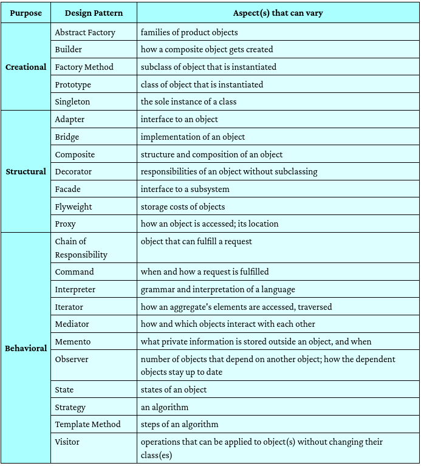

Designs Patterns ---> so basically an already made strategies to solve the common issues in development 
                    so i can imagine this like a general who have experiance in war ..advices on it 

with this strategies ..usually (on what we are going to learn) it devieded to--> Creational Patterns |Structural Patterns|Behavioral Patterns

--->  Creational --> Class Instantiation 
--->  Structural --> Store Information 
--->  Behavioral --> Communication Between Objects

"Each pattern describes a problem which occurs over and over again ... and then describes the core of the solution to that problem, in such a way that you can use this solution a million times over, without doing it the same way twice." -- Christopher Alexander

Goal:  to help make your software more flexible and reusable 

but why we study this shit ?:
    its easy to make products but its hard to maintain it 
    ( something similar to this ...easy to be in the top but its hard to be still in the top )

    Patterns are for Reuse

## List of the Original Patterns

